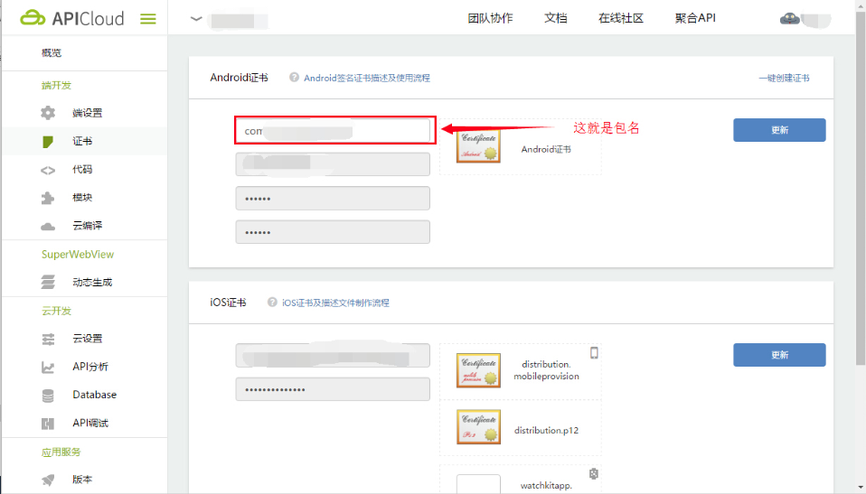
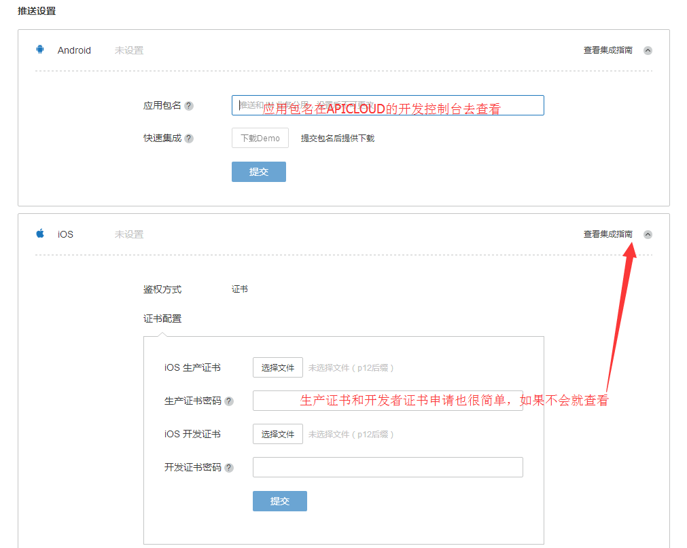

# APICloud极光推送的使用
::: tip
 [极光推送官网](https://www.jiguang.cn/) [APICloud Jpush使用文档](https://docs.apicloud.com/Client-API/Open-SDK/ajpush)
:::

### 注册极光推送
登录上面官网注册账号，然后进入开发者专区，创建应用，创建时只需要名字和logo自己根据自己的信息的填写好了,下面为应用信息，AppKey要用到

### APICloud配置
登录APICloud,打开自己的应用，然后先创建证书，打开左侧菜单端开发>证书，在安卓栏右上角创建证书，填写密码就好了,标志的包名后面要用到

### 引入JPush
在合适的地方，比如入口处引入
```js
apiready = function() {
  initJpush()
};
function initJpush(){
  var ajpush = api.require('ajpush');
  var param = {alias:'user1',tags:['user']};
  //设置用户绑定极光推送别名
  //解释一下，别名：是为某个用户添加的别名，一个用户一个别名。标签，多个用户可以使用同一个标签或者多个标签。
  //这个好处在于，比如我有一条通知要向公司所有人事部门的人员都收到。那我只需要把人事部的所有人在登录时绑定他们的标签是一样的就行。又比如我只往某一个用户发送通知，其它人不必收到这个通知。那么你只需要往某一个别名发送即可。
  ajpush.bindAliasAndTags(param,function(ret) {
    alert(ret.statusCode)
  });
  ajpush.init(function(ret) {
    alert('初始化成功')
    ajpush.setListener( function (ret){
      api.notification({//自定义消息展示的内容
          vibrate: new Array(12).fill(1000),
          light: true,
          notify: {
            title: '您有一条新信息啊',
            content: ret.content,
            extra: ret.extra || {}
          }
        })
      })
  });
  api.addEventListener({//处理自定义消息，监听点击
    name: 'noticeclicked'
  }, (ret) => {
    api.stopPlay()
    // do...
    alert('被点击了')
  })
}
```
切记！上传代码，然后云编译，安装app
### 推送设置
集成Android，应用包名就是Apicloud的应用包名，复制保存！
<!--  -->
然后点击最下面的立即发送，看结果