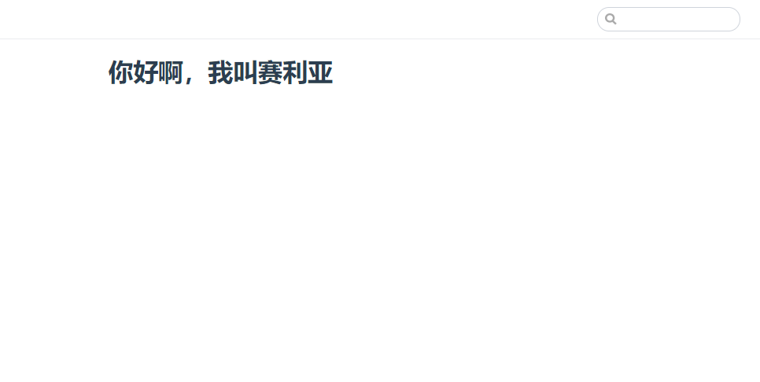
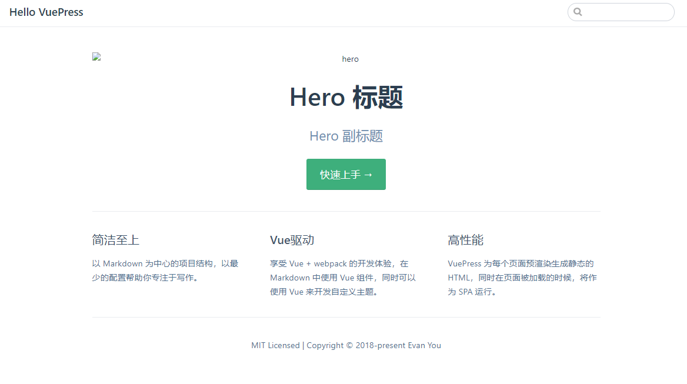

# vuepress快速搭建属于自己的小站
::: tip
这里主要介绍快速搭建vuepress模板，更多配置查看[官方文档](https://www.vuepress.cn/)
:::
## 基本框架搭建
1.新建项目目录template，进入项目目录，快速初始化package.json
```js
npm init -y
```
2.配置package.json，配置如下
```json
{
  "scripts": {
    "docs:dev": "vuepress dev docs",
    "docs:build": "vuepress build docs"
  }
}
```
3.根目录新增docs文件夹，里面新增README.md，随便加一些内容
```
# 你好啊，我叫赛利亚
```
4.安装vuepress
```js
yarn add -D vuepress 或者 npm install -D vuepress
```
5.万事俱备，启动！
```js
yarn docs:dev # 或者：npm run docs:dev
```
6.启动成功！以下为效果图


## 网站配置文件
1.docs文件夹下新建.vuepress文件夹，接着在.vuepress里新建config.js，目录结构如下
```
.
├─ docs
│  ├─ README.md
│  └─ .vuepress
│     └─ config.js
└─ package.json
```
2.config.js是vuepress网站必要的配置文件
```js
module.exports = {
    //网站的标题，它将会被用作所有页面标题的前缀，同时，默认主题下，它将显示在导航栏（navbar）上。
    title: 'Hello VuePress',
    //网站的描述，它将会以 <meta> 标签渲染到当前页面的 HTML 中。
    description: 'Just playing around',
    //基础路径，默认'/'，一般配置在部署的时候，需要配置到子路径下的时候来配置他
    base:'/',
    //额外的需要被注入到当前页面的 HTML <head> 中的标签,如自定义favicon
    head: [
        ['link', { rel: 'icon', href: '/logo.png' }]
    ],
    //为当前的主题提供一些配置,后面导航栏和侧边栏也在这配置，后面再介绍
    themeConfig:{}
    //...更多查看上方官方文档
}
```

## 默认主题配置
### 首页
根据目录的README.md,默认是网站的首页，看下官方给的例子：
```yaml
---
home: true
heroImage: /hero.png
heroText: Hero 标题
tagline: Hero 副标题
actionText: 快速上手 →
actionLink: /zh/guide/
features:
- title: 简洁至上
  details: 以 Markdown 为中心的项目结构，以最少的配置帮助你专注于写作。
- title: Vue驱动
  details: 享受 Vue + webpack 的开发体验，在 Markdown 中使用 Vue 组件，同时可以使用 Vue 来开发自定义主题。
- title: 高性能
  details: VuePress 为每个页面预渲染生成静态的 HTML，同时在页面被加载的时候，将作为 SPA 运行。
footer: MIT Licensed | Copyright © 2018-present Evan You
---
```
可以将相应的内容设置为 null 来禁用标题和副标题。把刚才docs/README.md加的'你好啊，我叫赛丽亚'更换为上面内容后，下面为效果图

大功搞成，首页GG，你可以根据自己的内容来修改-.-
### 导航栏
>导航栏可能包含你的页面标题、搜索框、 导航栏链接、多语言切换、仓库链接，它们均取决于你的配置。
```js
// .vuepress/config.js
module.exports = {
  //导航栏 Logo ，Logo 可以被放置在公共文件目录
  themeConfig: {
    logo: '/assets/img/logo.png',
  },
  //导航栏链接:
  nav: [
    { text: 'Home', link: '/' },
    { text: 'Guide', link: '/guide/' },
    { text: 'External', link: 'https://google.com' },
    //外部链接 <a> 标签的特性将默认包含target="_blank" rel="noopener noreferrer"
    //你可以提供 target 与 rel，它们将被作为特性被增加到 <a> 标签上：
    { text: 'External', link: 'https://google.com', target:'_self', rel:'' },
    { text: 'Guide', link: '/guide/', target:'_blank' }
    //提供了一个 items 数组而不是一个单一的 link 时，它将显示为一个 下拉列表 
    {
      text: 'Languages',
      ariaLabel: 'Language Menu',
      items: [
        { text: 'Chinese', link: '/language/chinese/' },
        { text: 'Japanese', link: '/language/japanese/' },
        //可以通过嵌套的 items 来在 下拉列表 中设置分组
        { text: 'Group2', items: [/*  */] }
      ]
    }
  ]
}
```
#### 禁用导航栏
```js
// .vuepress/config.js
module.exports = {
  themeConfig: {
    navbar: false
  }
}
```
也可以通过 YAML front matter 来禁用某个指定页面的导航栏(就像设置主页内容一样)：
```yaml
---
navbar: false
---
```
### 侧边栏
这面只介绍不同页面设置不同的侧边栏，因为我觉得公用的实在是没想到用的地方,[官方侧边栏配置](https://www.vuepress.cn/theme/default-theme-config.html#%E4%BE%A7%E8%BE%B9%E6%A0%8F)<br>
比方说这是你的目录结构,foo和bar需要不同的侧边栏
```
.
├─ README.md
├─ contact.md
├─ about.md
├─ foo/
│  ├─ README.md
│  ├─ one.md
│  └─ two.md
└─ bar/
   ├─ README.md
   ├─ three.md
   └─ four.md
```
那么就可以这样配置
```yaml
// .vuepress/config.js
module.exports = {
  themeConfig: {
    sidebar: {
      '/foo/': [
        '',     /* /foo/ */
        'one',  /* /foo/one.html */
        'two'   /* /foo/two.html */
      ],

      '/bar/': [
        '',      /* /bar/ */
        'three', /* /bar/three.html */
        'four'   /* /bar/four.html */
      ],

      // fallback
      '/': [
        '',        /* / */
        'contact', /* /contact.html */
        'about'    /* /about.html */
      ]
    }
  }
}
```
这只是一种写法，你可以按下面这个来继续往下嵌套
```yaml
// .vuepress/config.js
module.exports = {
  themeConfig: {
    sidebar: {
      '/a/': [
        {
          title:'A',
          children:[
            {
              title:'a-1',
              path:'a/a-1',
               children:[
                 {
                   title:'a-1-1',
                   path:'a/a-1/a-1-1'
                 }
               ]
            }
          ]
        }
      ]
    }
  }
}
```

自动生成侧边栏
```js
// .vuepress/config.js
module.exports = {
  themeConfig: {
    sidebar: 'auto'
  }
}
```
也可以通过 YAML front matter 来实现：
```yaml
---
sidebar: auto
---
```
在 多语言 模式下, 你也可以将其应用到某一特定的语言下：
```js
// .vuepress/config.js
module.exports = {
  themeConfig: {
     '/zh/': {
       sidebar: 'auto'
     }
  }
}
```
禁用侧边栏,通过 YAML front matter 来禁用指定页面的侧边栏：
```yaml
---
sidebar: false
---
```